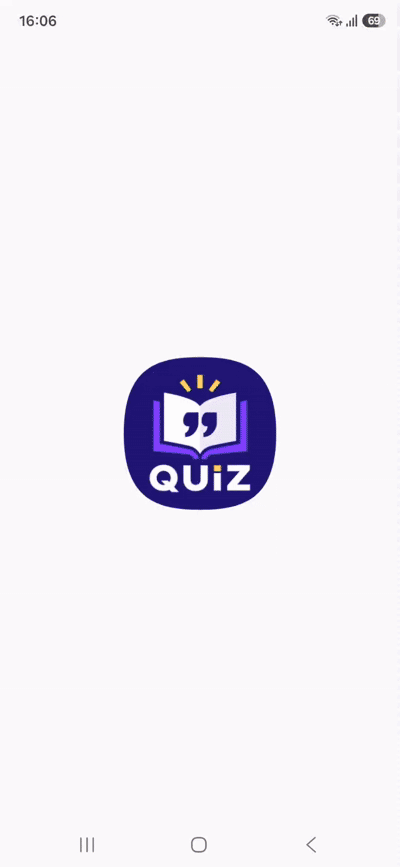
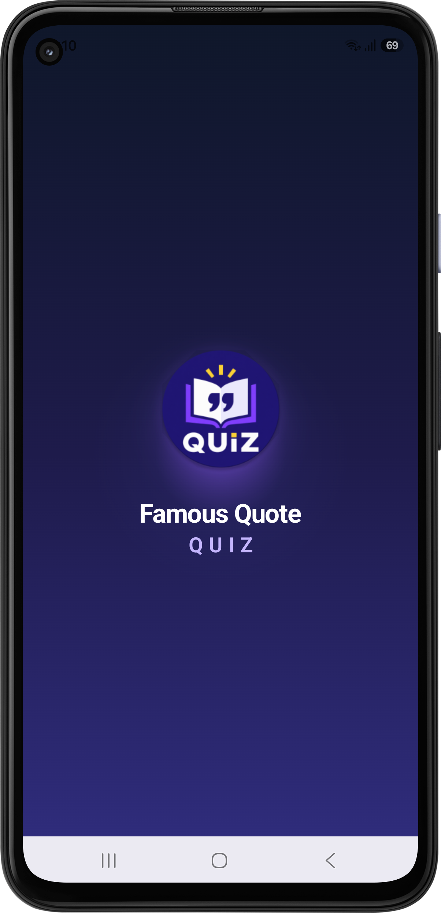
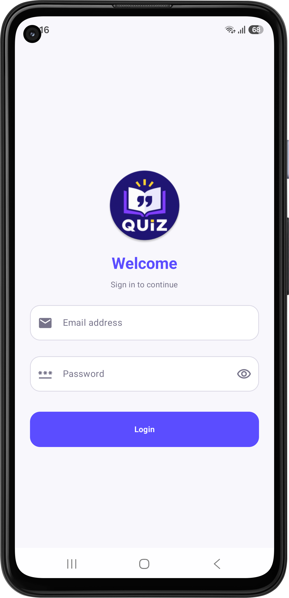
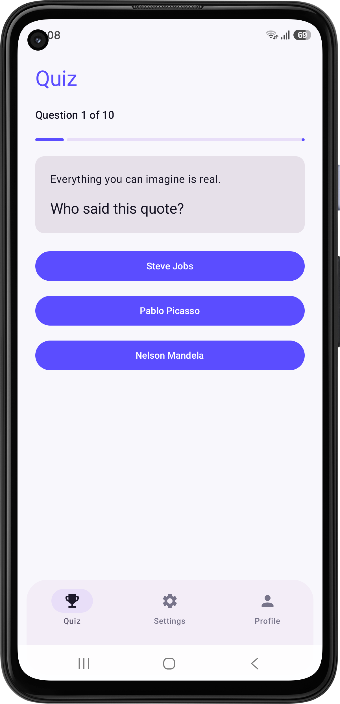
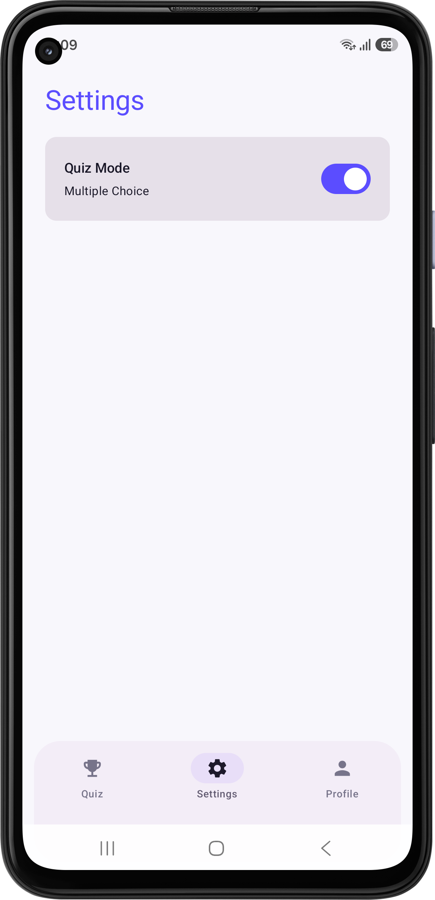
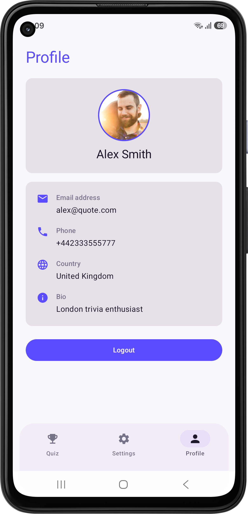

# Famous Quote Quiz

<p align="center">
  
</p>

<p align="center">
  A Kotlin Multiplatform and Compose Multiplatform mobile application
  powered by a Kotlin Spring Boot backend.
</p>

---

## 1. Demo

<p align="center">
  
</p>

---

## 2. Screenshots

<p align="center">
  
  
</p>

<p align="center">
  
  
  
</p>

---

## 3. Tech Stack

### 3.1 Client

<p align="center">


</p>

* **Kotlin Multiplatform** — Shared business logic across platforms
* **Compose Multiplatform** — Shared declarative UI
* **MVI** — Unidirectional state and event management
* **Clean Architecture** — Separation of presentation, domain, and data layers
* **Koin** — Dependency injection
* **Ktor Client** — Networking and API communication
* **Kotlin Coroutines** — Asynchronous programming
* **Kotlin Flow** — Reactive data streams
* **Navigation 3** — Application navigation
* **Persistent Session Storage** — Persistent authentication session management

### 3.2 Backend

<p align="center">


</p>

* **Kotlin** — Backend development
* **Spring Boot** — REST API and application framework
* **Spring Security** — Authentication and authorization
* **JWT** — Stateless authentication
* **Spring Data JPA** — Data persistence and database access
* **H2 Database** — Lightweight relational database
* **Gradle** — Build automation and dependency management

---

## 4. Running the Application

### Prerequisites

The mobile device and the development computer running the backend server must be connected to the **same network**.

### 4.1 Start the Server

1. Open the **QuizServer** project in IntelliJ IDEA.
2. Run `QuizServerApplication`.
3. Verify that the server starts successfully and the logs contain:

```text
Tomcat started on port 8080 (http)
```

### 4.2 Configure the Mobile Application

1. Open the **Quiz** project in Android Studio.
2. Find the local IP address of the computer running the **QuizServer** backend application.
3. Open the following file:

```text
shared/src/commonMain/com/ajantha/quiz/core/network/NetworkConfig
```

4. Update the `BASE_URL` with the IP address found in Step 2, using port `8080`.

**Example:**

```text
BASE_URL = "http://192.168.8.125:8080"
```

5. Build and run the mobile application on the connected device.
6. Use the following credentials to log in to the application:

```text
Email: alex@quote.com
Password: Pass@123
```

> **Note:** The mobile device and the computer running the backend server must be connected to the same network for the mobile application to communicate with the server.

---

## 5. API Documentation

The backend exposes REST APIs for authentication, quiz session management, and answer submission.

---

### 5.1 Login

Authenticates a user and returns a JWT token along with the user's profile information.

#### Endpoint

```http
POST /api/auth/login
```

#### Authentication

Not required.

#### Request

**Headers**

```http
Content-Type: application/json
```

**Body**

```json
{
  "email": "alex@quote.com",
  "password": "Pass@123"
}
```

#### Response

```json
{
  "token": "<JWT_TOKEN>",
  "user": {
    "id": 1,
    "email": "alex@quote.com",
    "name": "Alex Smith",
    "profileUrl": "https://i.pravatar.cc/300?img=53",
    "phone": "+442333555777",
    "country": "United Kingdom",
    "bio": "London trivia enthusiast"
  }
}
```

The client stores the returned session information and uses the JWT token to authenticate subsequent protected API requests.

---

### 5.2 Quiz API

All quiz endpoints require authentication.

The JWT must be included in the `Authorization` header:

```http
Authorization: Bearer <JWT_TOKEN>
```

---

### 5.3 Create Quiz Session

Creates a new quiz session containing **10 questions**.

#### Endpoint

```http
GET /api/quiz/session?mode={mode}
```

#### Authentication

Required.

#### Supported Modes

```text
BINARY
MULTIPLE_CHOICE
```

---

#### 5.3.1 Binary Mode

Binary mode asks the user whether the displayed author said the given quote.

#### Request

```http
GET /api/quiz/session?mode=BINARY
```

#### Response

```json
{
  "sessionId": "8c4d9c8e-...",
  "mode": "BINARY",
  "questions": [
    {
      "id": 1,
      "quote": "It always seems impossible until it's done.",
      "question": "Did Nelson Mandela say this quote?",
      "options": [
        "Yes",
        "No"
      ]
    }
  ]
}
```

The correct answer is maintained internally by the backend and is **not exposed** when the quiz session is created.

---

#### 5.3.2 Multiple Choice Mode

Multiple Choice mode asks the user to identify the author of the displayed quote.

Each question provides **three possible answers**, with one correct answer.

#### Request

```http
GET /api/quiz/session?mode=MULTIPLE_CHOICE
```

#### Response

```json
{
  "sessionId": "8c4d9c8e-...",
  "mode": "MULTIPLE_CHOICE",
  "questions": [
    {
      "id": 1,
      "quote": "It always seems impossible until it's done.",
      "question": "Who said this quote?",
      "options": [
        "Nelson Mandela",
        "Albert Einstein",
        "Winston Churchill"
      ]
    }
  ]
}
```

The backend generates the answer options and keeps the correct answer internal until the user submits an answer.

---

### 5.4 Submit Quiz Answer

Submits the user's selected answer for the current question.

#### Endpoint

```http
POST /api/quiz/{sessionId}/answer
```

#### Authentication

Required.

#### Request

**Headers**

```http
Content-Type: application/json
Authorization: Bearer <JWT_TOKEN>
```

**Body**

```json
{
  "questionId": 1,
  "answer": "Nelson Mandela"
}
```

#### Response

```json
{
  "correct": true,
  "correctAnswer": "Nelson Mandela",
  "currentQuestion": 1,
  "totalQuestions": 10,
  "correctAnswers": 1,
  "completed": false
}
```

The backend validates the submitted answer and returns the result.

The `correctAnswer` is revealed **only after the answer has been submitted**.

The `completed` field indicates whether the quiz session has been completed.

---

## 6. Future Recommendations

1. **Offline-First Architecture** — Add local persistence and synchronization so users can continue playing quizzes when network connectivity is unavailable or unstable.
2. **Dynamic Theme Support** — Add Light, Dark, and System theme options using Material 3 theming, allowing users to customize the application's appearance.
3. **Accessibility Improvements** — Improve screen-reader support, touch target sizes, text scaling, color contrast, and semantic labels to make the application accessible to a wider range of users.
4. **AI-Powered Personalized Quiz Generation** — Use AI to analyze users' quiz performance and generate personalized questions with appropriate difficulty, topics, and variety based on their learning progress.
5. **Push Notifications & Engagement** — Add optional notifications for new quizzes, daily challenges, and personal progress to encourage users to return to the application.
